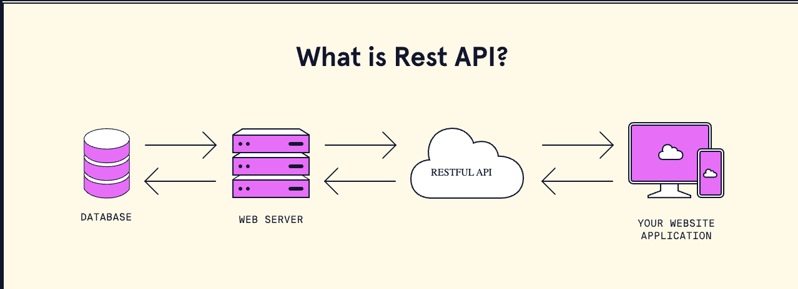

# 2. Web APIs and REST


# Web APIs
An *Application Programming Interface* (*API*) is a software tool that makes it easier for developers to interact with another application to use some of that application’s functionality. Like tools in the physical world, APIs are built to solve specific, repeated, and potentially complex problems.

## Types of APIs
### 
### **Browser APIs**
*Browser APIs* are specific to writing code related to browsers and give developers access to information that the browser can also access. One example is the <u>[geolocation API](https://developer.mozilla.org/en-US/docs/Web/API/Geolocation_API)</u> which allows the program to know where a user is when accessing our app. This specific API requires that the user grant permissions to the browser to access their geolocation information. There are also browser APIs for audio, cryptography, VR, and much more. To see a comprehensive list of browser APIs and how to interact with them, check out <u>[MDN’s documentation of web APIs](https://developer.mozilla.org/en-US/docs/Web/API)</u>.
### 
### **Third-party APIs**
### *Third-party APIs* are apps that provide some type of functionality or information from a third-party, usually a company. For example, we could use the <u>[OpenWeather API](https://openweathermap.org/)</u> to get in-depth information about the weather in an area, forecasts, historical weather data, and more! On our own, we wouldn’t even have access to this data and we would certainly not want to write up this code ourselves just for one app!

### **Rules and Requirements**
Each API has a specific structure and protocol that we have to follow in order to gain access to its functionality.
Organizations that maintain third-party APIs often set rules and requirements for how developers can interact with their APIs. For OpenWeather, we need to sign up for an account and generate a special token called an *API key* that grants our account the ability to make API requests. These API keys are unique to individual accounts and should be kept secret. OpenWeather provides some free functionality and some paid functionality. So before committing to a third-party API, check out their specifications which can often be found in the API documentation. Here’s <u>[OpenWeather’s documentation](https://openweathermap.org/api)</u> to look over as an example.
### 
### **Making Requests**
Some of an API’s specifications relate to making a *request* for data. These specifications could include more parameters for specific information or the inclusion of an API key. For example, when using the OpenWeather API, we need to provide more information to search for weather information — such information could include: the name of a city, time of day, the type of forecast, etc. These specifications for making a request can also be found in the API documentation.
### 
### **Response Data**
### After we make a successful API request, the API sends back data. Many APIs format their data using <u>*[JavaScript Object Notation](https://www.codecademy.com/article/what-is-json)*</u><u>[ (](https://www.codecademy.com/article/what-is-json)</u><u>*[JSON](https://www.codecademy.com/article/what-is-json)*</u><u>[)](https://www.codecademy.com/article/what-is-json)</u> which looks like a JavaScript object. Here’s a quick example of what JSON data might look like:

```
**{ 
  "temperature" : { 
     "celcius" : 25,
  },
  "city": "chicago", 
}**

```


```


```


# **REST (REpresentational State Transfer**)

REST, or REpresentational State Transfer, is an architectural style for providing standards between computer systems on the web, making it easier for systems to communicate with each other. REST-compliant systems, often called RESTful systems, are characterized by how they are stateless and separate the concerns of client and server.

## **Separation of Client and Server**
In the REST architectural style, the implementation of the client and the implementation of the server can be done independently without each knowing about the other. This means that the code on the client side can be changed at any time without affecting the operation of the server, and the code on the server side can be changed without affecting the operation of the client.
By using a REST interface, different clients hit the same REST endpoints, perform the same actions, and receive the same responses.
Systems that follow the REST paradigm are stateless, meaning that the server does not need to know anything about what state the client is in and vice versa. In this way, both the server and the client can understand any message received, even without seeing previous messages. This constraint of statelessness is enforced through the use of *resources*, rather than *commands*. Resources are the nouns of the Web - they describe any object, document, or *thing* that you may need to store or send to other services.

## **Communication between Client and Server**
In the REST architecture, clients send requests to retrieve or modify resources, and servers send responses to these requests. Let’s take a look at the standard ways to make requests and send responses.

### **Making Requests**
REST requires that a client make a request to the server in order to retrieve or modify data on the server. A request generally consists of:
* an HTTP verb, which defines what kind of operation to perform
* a *header*, which allows the client to pass along information about the request
* a path to a resource
* an optional message body containing data

### **HTTP Verbs**
There are 4 basic HTTP verbs we use in requests to interact with resources in a REST system:
* GET — retrieve a specific resource (by id) or a collection of resources
* POST — create a new resource
* PUT — update a specific resource (by id)
* DELETE — remove a specific resource by id
You can learn more about these HTTP verbs in the following Codecademy article:
* <u>[What is CRUD?](https://www.codecademy.com/articles/what-is-crud)</u>### 
### **Headers and Accept parameters**
In the header of the request, the client sends the type of content that it is able to receive from the server. This is called the Accept field, and it ensures that the server does not send data that cannot be understood or processed by the client. The options for types of content are MIME Types (or Multipurpose Internet Mail Extensions), which you can read more about in the <u>[MDN Web Docs](https://developer.mozilla.org/en-US/docs/Web/HTTP/Basics_of_HTTP/MIME_types)</u>.
MIME Types, used to specify the content types in the Accept field, consist of a type and a subtype. They are separated by a slash (/).
For example, a text file containing HTML would be specified with the type text/html. If this text file contained CSS instead, it would be specified as text/css. A generic text file would be denoted as text/plain. This default value, text/plain, is not a catch-all, however. If a client is expecting text/css and receives text/plain, it will not be able to recognize the content.
Other types and commonly used subtypes:
* image — image/png, image/jpeg, image/gif
* audio — audio/wav, audio/mpeg
* video — video/mp4, video/ogg
* application — application/json, application/pdf, application/xml, application/octet-stream

### **Paths**
Requests must contain a path to a resource that the operation should be performed on. In RESTful APIs, paths should be designed to help the client know what is going on.
Conventionally, the first part of the path should be the plural form of the resource. This keeps nested paths simple to read and easy to understand.
A path like fashionboutique.com/customers/223/orders/12 is clear in what it points to, even if you’ve never seen this specific path before, because it is hierarchical and descriptive. We can see that we are accessing the order with id 12 for the customer with id 223.
Paths should contain the information necessary to locate a resource with the degree of specificity needed. When referring to a list or collection of resources, it is not always necessary to add an id. For example, a POST request to the fashionboutique.com/customers path would not need an extra identifier, as the server will generate an id for the new object.
If we are trying to access a single resource, we would need to append an id to the path. For example: GET fashionboutique.com/customers/:id — retrieves the item in the customers resource with the id specified. DELETE fashionboutique.com/customers/:id — deletes the item in the customers resource with the id specified.

### **Sending Responses**
In cases where the server is sending a data payload to the client, the server must include a content-type in the header of the response. This content-type header field alerts the client to the type of data it is sending in the response body. These content types are MIME Types, just as they are in the accept field of the request header. The content-type that the server sends back in the response should be one of the options that the client specified in the accept field of the request.
For example, when a client is accessing a resource with id 23 in an articles resource with this GET Request:

```
GET /articles/23 HTTP/1.1
Accept: text/html, application/xhtml

```

The server might send back the content with the response header:

```
HTTP/1.1 200 (OK)
Content-Type: text/html

```

### 
### **Response Codes**
Responses from the server contain status codes to alert the client to information about the success of the operation. As a developer, you do not need to know every status code (there are <u>[many](http://www.restapitutorial.com/httpstatuscodes.html)</u> of them), but you should know the most common ones and how they are used:
| Status code                                                                                                       | Meaning                                                                                                           |
|-------------------------------------------------------------------------------------------------------------------|-------------------------------------------------------------------------------------------------------------------|
| 200 (OK)                                                                                                          | This is the standard response for successful HTTP requests.                                                       |
| 201 (CREATED)                                                                                                     | This is the standard response for an HTTP request that resulted in an item being successfully created.            |
| 204 (NO CONTENT)                                                                                                  | This is the standard response for successful HTTP requests, where nothing is being returned in the response body. |
| 400 (BAD REQUEST)                                                                                                 | The request cannot be processed because of bad request syntax, excessive size, or another client error.           |
| 403 (FORBIDDEN)                                                                                                   | The client does not have permission to access this resource.                                                      |
| 404 (NOT FOUND)                                                                                                   | The resource could not be found at this time. It is possible it was deleted, or does not exist yet.               |
| 500 (INTERNAL SERVER ERROR)                                                                                       | The generic answer for an unexpected failure if there is no more specific information available.                  |

For each HTTP verb, there are expected status codes a server should return upon success:
* GET — return 200 (OK)
* POST — return 201 (CREATED)
* PUT — return 200 (OK)
* DELETE — return 204 (NO CONTENT) If the operation fails, return the most specific status code possible corresponding to the problem that was encountered.

## **RESTful API Example – Customer Management**

**Context:**
An application for the clothing store fashionboutique.com allows viewing, creating, updating, and deleting customers through an HTTP RESTful API.

**1. View all customers**
**Request:**

```
GET http://fashionboutique.com/customers
Accept: application/json

```

**Response:**

```
Status Code: 200 OK
Content-Type: application/json

```

The response body contains the full list of customers in JSON format.

**2. Create a new customer**
**Request:**

```
POST http://fashionboutique.com/customers
Content-Type: application/json
{
  "customer": {
    "name": "Scylla Buss",
    "email": "scylla.buss@codecademy.org"
  }
}

```

**Response:**

```
Status Code: 201 CREATED
Content-Type: application/json

```

The server creates the customer and returns the object with an assigned id.

**3. View a single customer**
**Request:**

```
GET http://fashionboutique.com/customers/123
Accept: application/json

```

**Response:**

```
Status Code: 200 OK
Content-Type: application/json

```

The response body contains the details of the customer with ID 123.

**4. Update an existing customer**
**Request:**

```
PUT http://fashionboutique.com/customers/123
Content-Type: application/json
{
  "customer": {
    "name": "Scylla Buss",
    "email": "scyllabuss1@codecademy.com"
  }
}

```

**Response:**

```
Status Code: 200 OK

```

The server confirms that the customer was successfully updated.

**5. Delete a customer**
**Request:**

```
DELETE http://fashionboutique.com/customers/123

```

**Response:**

```
Status Code: 204 NO CONTENT

```

The server deletes the specified customer and returns no content in the response body.


