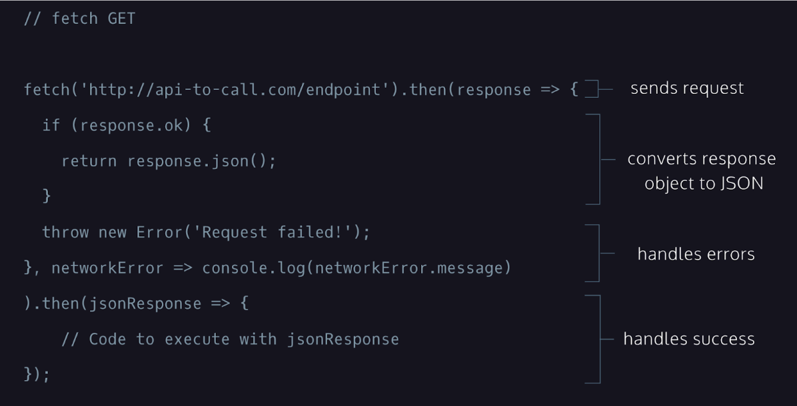
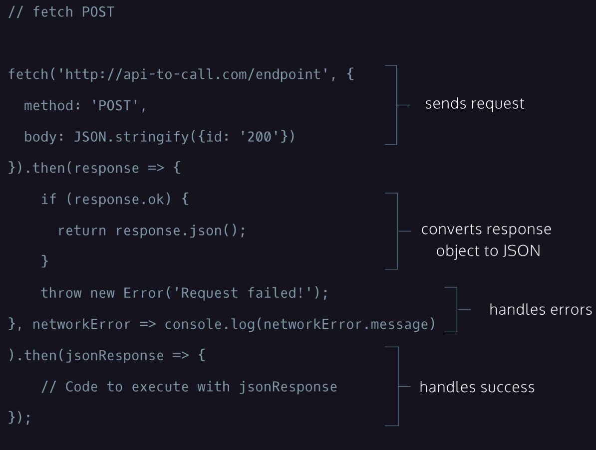

# 4. fetch() with .then()


The fetch() function:
* Creates a request object that contains relevant information that an API needs.
* Sends that request object to the API endpoint provided.
* Returns a promise that ultimately resolves to a response object, which contains the status of the promise with information the API sent back.
First, call the fetch() function and pass it a URL as a string for the first argument, determining the endpoint of the request.

```
fetch('https://api-to-call.com/endpoint')

```

The .then() method is chained at the end of the fetch() function and in its first argument, the response of the GET request is passed to the callback arrow function. The .then() method will fire only after the promise status of fetch() has been resolved.
A second argument passed to .then() will be another arrow function that will be triggered when the promise is rejected. It takes a single parameter, networkError. This object logs the networkError if we could not reach the endpoint at all (e.g., the server is down).
A second .then() method will run after the previous .then() method has finished running without error. It takes jsonResponse, which contains the returned response.json() object from the previous .then() method, as its parameter and can now be handled, however we may choose.

## fetch GET

```
// fetch GET

fetch('http://api-to-call.com/endpoint').then(response => {
  if (response.ok) {
    return response.json();
  }
  throw new Error('Request failed!');
}, networkError => console.log(networkError.message)
).then(jsonResponse => {
  // Code to execute with jsonResponse
});

```



## fetch POST
Notice that the fetch() call takes two arguments: an endpoint and an object that contains information needed for the POST request.
The object passed to the fetch() function as its second argument contains two properties: method, with a value of 'POST', and body, with a value of JSON.stringify({id: '200'});. This second argument determines that this request is a POST request and what information will be sent to the API.
A successful POST request will return a response body, which will vary depending on how the API is set up.
The rest of the request is identical to the GET request. A .then() method is chained to the fetch() function to check and return the response as well as throw an exception when a network error is encountered. A second .then() method is added on so that we can use the response however we may choose.


```
// fetch POST

fetch('http://api-to-call.com/endpoint', {
  method: 'POST',
  body: JSON.stringify({id: '200'})
}).then(response => {
  if (response.ok) {
    return response.json();
  }
  throw new Error('Request failed!');
}, networkError => console.log(networkError.message)
).then(jsonResponse => {
  // Code to execute with jsonResponse
});

```



