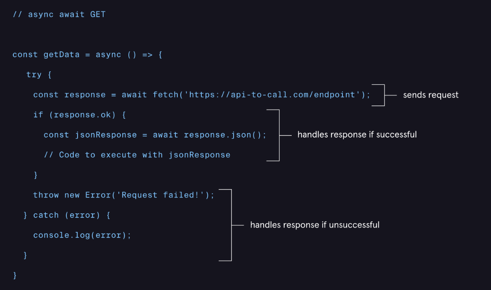
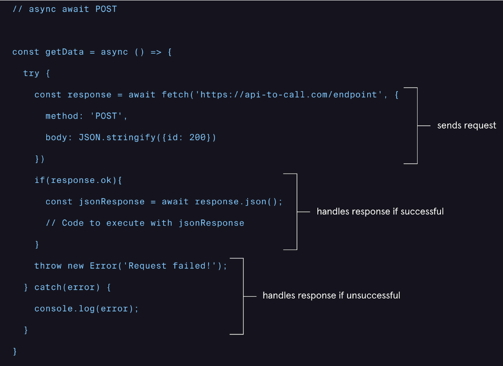

# 6. fetch() with await… async


The await… async is the most common used one (more clear and simple to debug)

## async await GET
Note that the ***.json()*** *method is* asynchronous so ***await*** must be used: ***await response.json()***

```
// async await GET

const getData = async () => {

  try {
    const response = await fetch('https://api-to-call.com/endpoint');
    if (response.ok) {
      const jsonResponse = await response.json();
      // Code to execute with jsonResponse
    }
    throw new Error('Request failed!');
  } catch (error) {
    console.log(error);
  }
};

```




## async await POST

```
// async await POST

const getData = async () => {
  try {
    const response = await fetch('https://api-to-call.com/endpoint', {
      method: 'POST',
      body: JSON.stringify({id: 200})
    });
    if (response.ok) {
      const jsonResponse = await response.json();
      // Code to execute with jsonResponse
    }
    throw new Error('Request failed!');
  } catch (error) {
    console.log(error);
  }
};

```


## 

Additional resources:
* Documentation: <u>[Ajax](https://developer.mozilla.org/en-US/docs/Web/Guide/AJAX)</u>Video: <u>[What the Heck is the Event Loop Anyways](https://www.youtube.com/watch?v=8aGhZQkoFbQ&feature=emb_title)</u>Resource: <u>[MDN’s Guide to Graceful asynchronous Programming with Promises](https://developer.mozilla.org/en-US/docs/Learn/JavaScript/Asynchronous/Promises)</u>Resource: <u>[MDN’s Guide to Choosing the Right Approach](https://developer.mozilla.org/en-US/docs/Learn/JavaScript/Asynchronous/Choosing_the_right_approach)</u>Article: <u>[MDN’s Introduction to web APIs](https://developer.mozilla.org/en-US/docs/Learn/JavaScript/Client-side_web_APIs/Introduction)</u>Article: <u>[MDN’s Overview of HTTP](https://developer.mozilla.org/en-US/docs/Web/HTTP/Overview)</u>Resource: <u>[MDN’s Guide to Fetching Data From the Server](https://developer.mozilla.org/en-US/docs/Learn/JavaScript/Client-side_web_APIs/Fetching_data)</u>Documentation: <u>[MDN: Using the Fetch API](https://developer.mozilla.org/en-US/docs/Web/API/Fetch_API/Using_Fetch)</u>Resource: <u>[MDN’s Guide to Third-party APIs](https://developer.mozilla.org/en-US/docs/Learn/JavaScript/Client-side_web_APIs/Third_party_APIs)</u>