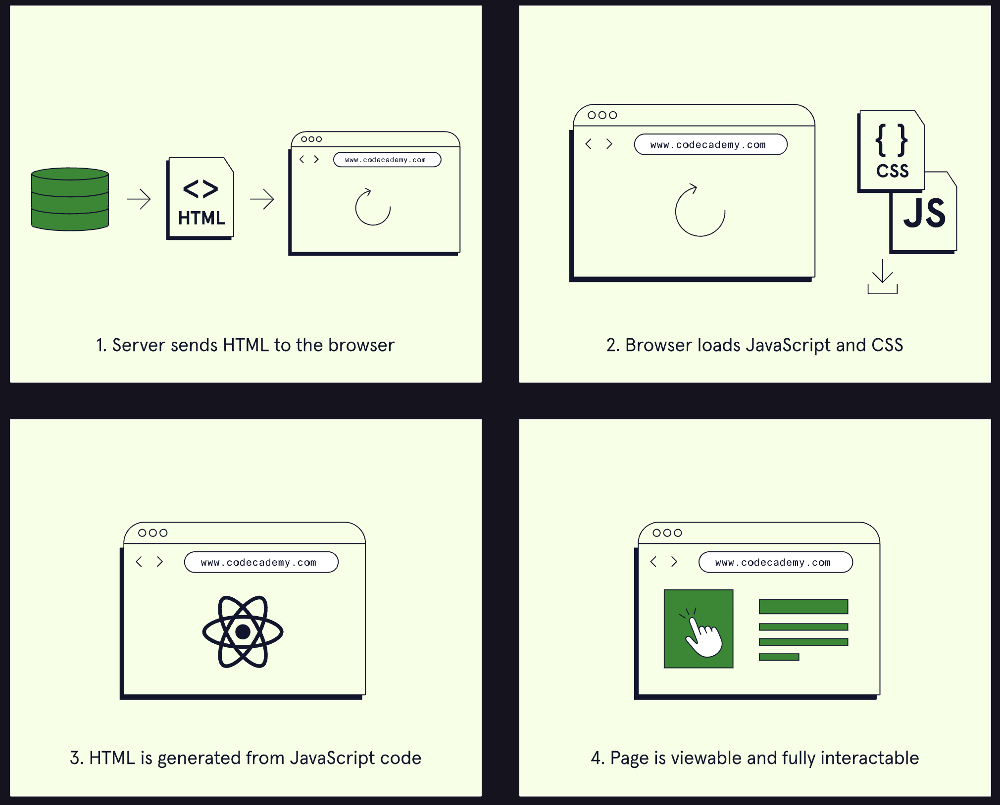
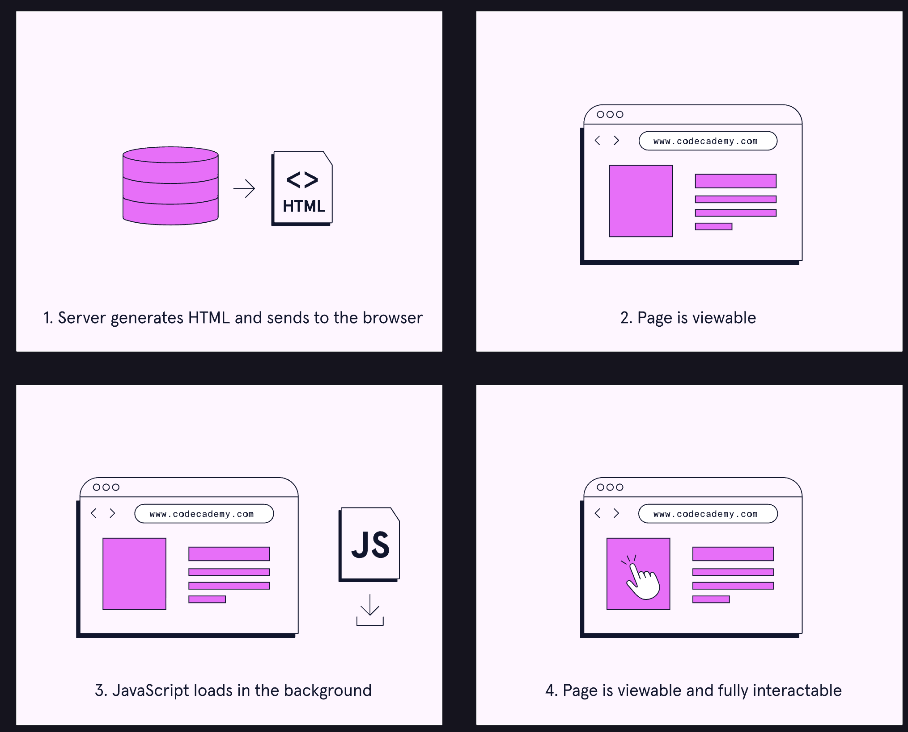
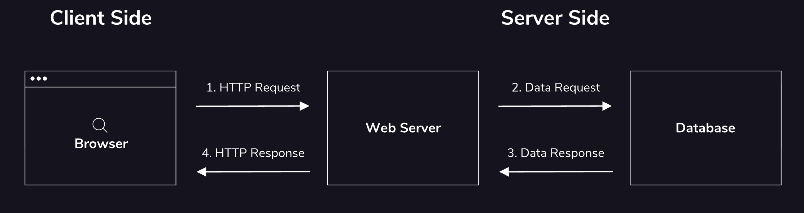

# 1. Client vs server

## **Client-Side Rendering**

In client-side rendering, the server sends the browser a boilerplate HTML document that includes a reference to a JavaScript file. This JavaScript code is responsible for dynamically generating content in the browser, as the user moves through the site. With client-side rendering, content is generated and rendered as needed; only the requested content will be loaded, at the time it is requested.
In terms of user experience, the initial page load can be slow, since the JavaScript first has to generate the content for a given view before it is visible and interactable. As the user navigates the app, however, JavaScript code will produce content directly in the browser. Since round-trip calls to the server are not necessary to render additional content, subsequent loads will be much faster.
Front-End frameworks like React, Vue, and Angular often rely on client-side rendering to deliver <u>[Single Page Applications](https://developer.mozilla.org/en-US/docs/Glossary/SPA)</u>.
When deciding whether client-side rendering is right for your app, consider the following pros and cons:
Pros:
* Fast speed after initial page load.
Cons:
* Poor <u>[Search Engine Optimization (SEO)](https://en.wikipedia.org/wiki/Search_engine_optimization)</u> performance with dynamically generated content.

## **Server-Side Rendering**

With <u>[server-side rendering](https://www.codecademy.com/resources/docs/general/server-side-rendering)</u>, all of the content for a given view is generated on the server, then sent to the browser to be rendered. Pages are generated and rendered on-demand. Every time the user navigates to a different page on the site, the server builds the web page and sends it to the client. Because the content is ready to be rendered when it arrives in the browser, the time it takes for the page to become viewable is usually quick.
Before the page is fully interactable, the browser must download and parse the JavaScript. This process can be slow, and largely depends on the amount of JavaScript code, the quality of the network connection, and the user’s device.
Since static content loads quickly, server-side rendering is ideal for informational sites where there is little interactivity. Implementing server-side rendering for sites that have rich interactions can lead to a poor user experience since more requests to the server need to be made, and JavaScript has to load before the user can engage with the site.
Consider the following pros and cons before choosing server-side rendering for your next app:
Pros:
* Visual elements of the page load quickly, since the content is ready to render before it’s sent to the browser.
* Better <u>[Search Engine Optimization (SEO)](https://en.wikipedia.org/wiki/Search_engine_optimization)</u> performance, since search engines can <u>[index](https://www.codecademy.com/resources/docs/general/database/index)</u> static content immediately.
Cons:
* <u>[Time to interactive (TTI)](https://developer.mozilla.org/en-US/docs/Glossary/Time_to_interactive)</u> can be slow if the page is JavaScript-heavy. Speed depends on many factors outside of the developer’s control, like network connection quality, and the user’s device.

## Summary
Front-end web development covers everything a user sees and interacts with directly in a web app. Back-end web development handles how the website works, including storing and retrieving data. The front-end and back-end communicate using the HTTP request/response cycle, where the server sends things like HTML, JavaScript, and data to the browser. Websites can use client-side rendering (content generated in the browser with JavaScript), server-side rendering (content sent from the server), or hybrid rendering (a mix of both). Client-side rendering is best for dynamic, interactive sites. Server-side rendering is better for mostly static sites. Hybrid rendering aims to balance speed, performance, and SEO

