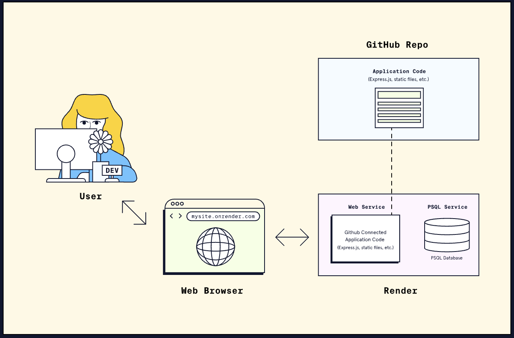

# 2. Deployment with Render

# 
For most modern software engineering teams, deployment plays a key role in ensuring software can eventually be accessed by an end-user. The deployment process can be complex and, at times, involves the collaboration of multiple engineering team members. It requires careful planning and execution to ensure the software is deployed smoothly. In recent years, <u>[cloud-based](https://www.codecademy.com/resources/docs/cloud-computing)</u> deployment solutions have become a popular option for helping developers quickly deploy applications without requiring extensive infrastructure or technical expertise.

## **Platform as a Service (PaaS)**
One popular type of cloud-based deployment solution is called a Platform as a Service (PaaS). A **PaaS** is an all-in-one platform for building, deploying, and managing applications over the internet. A PaaS often uses a set of assumptions about the things most software teams need as a way of simplifying the complex task of setting up infrastructure.
Other benefits of using a PaaS provider include the following:
* The PaaS provider handles the building and running of the developer’s code
* Some PaaS providers offer additional resources, such as databases, for the developer to integrate and use within the project
* The PaaS provider handles the regular upgrades and maintenance of the infrastructure components
* The PaaS provider may handle some security aspects of the infrastructure
* The PaaS provider may provide options for easily scaling resources, either manually or automatically, to accommodate a growing number of users that are using the application

## **Render**
<u>[Render](https://render.com/)</u> is a popular PaaS product that handles the building and deployment of code and provides the resources necessary to host various applications and services. By using Render for deployment, we can quickly deploy a running prototype of an application to potential users. Render supports several different programming languages, including Python, Ruby, and Javascript. Render also offers other features such as managed databases, static site hosting, and integration with popular developer tools like GitHub and Slack.

* Our application code lives in the GitHub repository and is connected to Render
* Render handles setting up the application’s infrastructure and deploying the code.
* The application code connects to the Render-hosted PostgreSQL database using the connection information provided by Render upon database setup.
* When the application is ready, it is made publicly available via a .onrender.com domain
