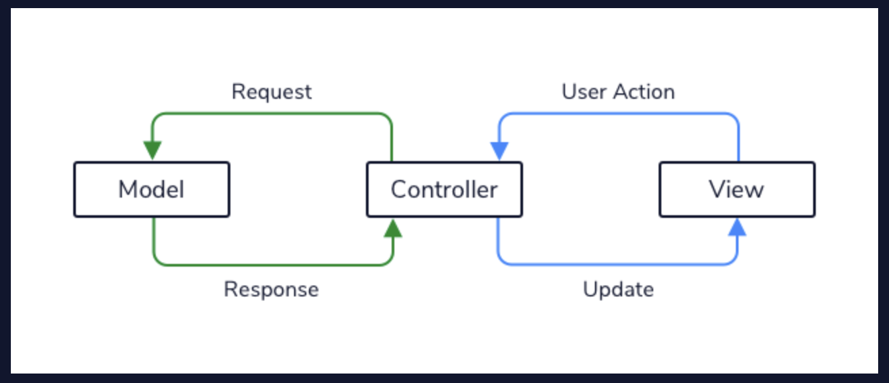

# 1. Model View Controller MVC

As we design our software we sometimes need to view and organize our system at the big picture level. One popular architectural pattern is the *Model View Controller* pattern, or *MVC*. Throughout this article, we will discuss the use of MVC to organize the main components of our systems by their functionality.

Model View Controller is an organizational design pattern used for applications that need:
* To move around data throughout the application.
* To display the visual and interactive elements to the users of the application.
* A means of having the user’s actions change the application data.

## **The Model**
The Model is made up of the data storage, as well as any classes that represent that data as it moves around the application. Data is often stored outside the application in a database or files. While the data can be stored in different formats, we often read data from storage into a representational object.

## **The View**
The View component is the classes that describe how our application will be presented to the user — it’s what the users see. These might be our React components or HTML elements in a web application or XML files in an Android application.

## **The Controller**
The Controller is the brain of our application. The View and the Model do not define much behavior for our applications, instead, they merely represent presentational and data objects. The Controller defines the behaviors that our system will accomplish using the Model and View. The Controller is responsible for receiving events (clicks, submitted forms, typing) passed in from the View and processing them to make meaningful responses. The Controller will interact with the Model, making queries or representing data as appropriate to make these responses happen.

## 
## **Benefits** 
The primary advantage of the MVC pattern is the separation of the data representation, logical, and presentational layers. By keeping these aspects from being highly tied together, they can be modified independently. Changing the Model should not require major changes to the View, and vice versa.
By separating the Controller from the View, we can create multiple ways of viewing our application. For example, an application can have the web and mobile Views interact with the same Controller. This can allow us to greatly reduce the amount of work needed to port our application to new means of user interaction.

## **Disadvantages**
The main drawback of MVC is that it can introduce unneeded complexity to an application. Having multiple components and structure may not be necessary for simpler applications. A decent guideline is that if our application requires multiple people for development, having a pattern such as MVC probably would be helpful. This will help team members reason about class intents and where an object might fit into the application.