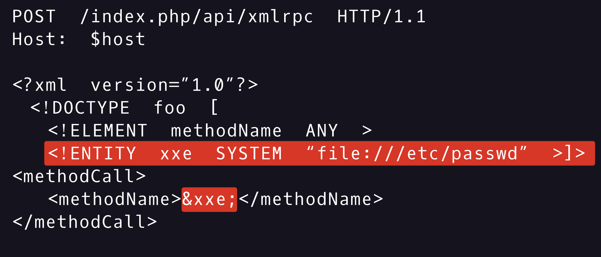
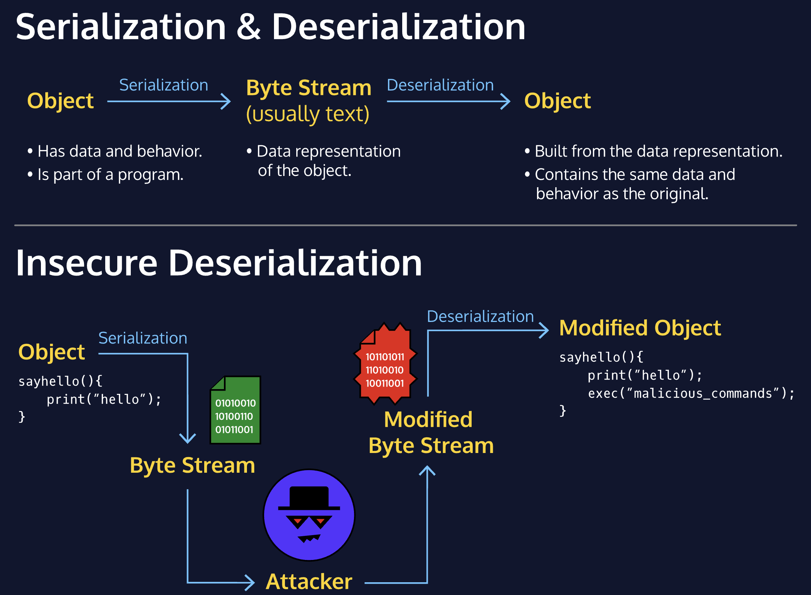

# 2. OWASP TOP 10

The <u>[OWASP Top Ten](https://owasp.org/www-project-top-ten/)</u> is a project maintained by the Open Web Application Security Project (OWASP). OWASP is a respected authority in the field of web security, and the Top Ten is a collection of the ten most serious vulnerabilities for web applications.
Many of these vulnerabilities have existed for a long time, yet still pose an active and serious threat; When a website gets compromised, the chances are good that at least one exploited vulnerability will be listed in the OWASP Top Ten.

## **Injection**
*Injection* is when an attacker injects malicious code into an interpreter in order to gain access to information or damage a system. This is often accomplished by inserting malicious characters into an input field on the website, and this malicious input is then sent to the interpreter. Sometimes, this will cause the interpreter to crash, but it can, in the worst case, cause the interpreter to start running code supplied by the attacker.
Interpreters for query languages such as SQL are a common target, but not the only one. In some cases, Injection attacks can even target the operating system the webserver is running, passing data that is executed as a terminal command.
Here is an example of normal Java code that searches for a product by name:

```
query = "SELECT product_name, product_cost FROM
product_table WHERE product_name = " + USER_INPUT + "'";

```

Here is a malicious query that searches for the product “soap” while attaching a  <span style="font-family: .AppleSystemUIFontMonospaced-Regular; font-size: 12.0;">
     UNION
 </span> command to steal usernames and passwords:

```
soap' UNION SELECT username,password,NULL FROM user_table;-- -

```

Here is what the code interpreter sees when the malicious query is added:

```
SELECT product_name, product_cost FROM
product_table WHERE product_name = 'soap' UNION SELECT username,password,NULL FROM user_table;-- -';

```


## **Broken Authentication**
In this case, the weakest link was a “temporary” admin account that was created for use only while the website was being built and has since been forgotten… By everyone except the hacker who had just logged in using admin as the username and password.
*Broken Authentication* is a broad term for vulnerabilities that allow attackers to impersonate other users. Vulnerabilities like insecure default credentials, lack of rate limiting for login attempts, and session hijacking all fall into this category. In the worst case, a malicious hacker would be able to gain access to an administrative account, and all the authorization that accompanies it.

## **Sensitive Data Exposure**
When data breaches happen, that’s not the end of the story. The stolen information gets sold and resold on the dark web, often ending up in sets of personal information known as *fullz*. Fullz contain information someone could use to commit the kinds of fraud that can ruin a victim’s life for years, and most of this information is on sale for $25 or less.

## **XML External Entities (XXE)**
Computers take things very literally; give them an instruction and they’ll follow it exactly, even when it’s not actually what you wanted. Servers are computers that have been instructed to respond to requests for data, and if you’re not careful, they’ll respond to requests like “details of every account on the OS the server is running” or “what happens if you run this piece of code?”.
Similar to Injection, *XML External Entities (XXE)* is a type of vulnerability that allows maliciously crafted data to produce unintended behavior on the backend of a website.
Unlike injection, where the malicious input is usually from an input field, XXE involves an attacker uploading a maliciously crafted <u>[XML](https://www.codecademy.com/resources/docs/general/xml)</u> file. XML is a markup language that supports potentially insecure features, and if a website is using an XML processor with those features enabled, an attacker can use XXE to wreak havoc. In the worst case, the attacker may be able to execute arbitrary code - just about the worst case scenario for security.

1. The first part, which says <!ENTITY xxe SYSTEM "file:///etc/passwd" >]>, defines an entity pointing to the etc password file.
2. The second part, which specifies &xxe; as the methodName, calls that reference.

## **Broken Access Control**
*Broken Access Control* is when authorization is improperly enforced, allowing users access to privileges they should not have. This category is more about vulnerabilities within the authorization system than it is about bypassing the system entirely. Because broken access control is such a broad category of vulnerabilities, it can have a wide range of consequences. Access to sensitive user data is one fairly common result, but the sky’s the limit.
Mitigation can involve things like rate limits for logins, ensuring server-side validation of requests, and implementing default-deny for permissions.

## **Security Misconfiguration**
*Security Misconfiguration* has been a problem since the early days of the internet, and it continues to be a problem today. Whether due to operator error or insecure default settings, insecure configurations can severely hamper the security of an environment.
Examples of Security Misconfiguration include things like:
* Forgetting to protect cloud storage
* Leaving unnecessary features enabled on server software
* Disabling automatic updates
* Displaying overly detailed error messages that give details about the way the backend is set up
It also includes improperly configured security software, such as weak or ineffective rules for Firewalls and Intrusion Detection Systems (IDSs).

## **Cross-Site Scripting (XSS)**
*Cross-Site Scripting (XSS)* is a web vulnerability that targets the browser-side of the website, rather than the server-side. XSS happens when a browser is tricked into running malicious javascript. It usually happens when a website allows user input without sanitizing and unarming dangerous input. If this happens, an attacker can pass input to the website that a victim’s browser will run as javascript.
XSS can be a severe vulnerability, particularly when the malicious input is stored by the website and displayed to many users. XSS has a wide range of uses, from defacing websites to bypassing authentication to stealing passwords.
Preventing XSS involves making sure that special characters like <, >, ", =, and more are properly escaped to prevent a browser from parsing them as code rather than regular text.

## **Insecure Deserialization**
Serialization is the process of turning an object within a program into formatted data. Deserialization is the process of turning formatted data into an object within code. *Insecure Deserialization* is when this process can be exploited to cause unintended behavior.
If an attacker is able to modify the data that is going to be deserialized, they can change the resulting object, modifying data or adding malicious behaviors. In the worst case, this can allow for arbitrary code execution.


## **Using Components with Known Vulnerabilities**
*Using Components with Known Vulnerabilities* means using software or package versions that are known to be vulnerable. Vulnerabilities are common in software, but they usually get patched as new updates are released. However, older versions of the software remain vulnerable!
The <u>[Common Vulnerabilities and Exposures system](https://cve.mitre.org/)</u> has detailed records of publicly-known vulnerabilities that have been exploited. This is usually used to help people protect themselves and patch these vulnerabilities, but this knowledge can also be used by malicious actors. There are even tools to do this research automatically, and these tools can determine what software a server is running and suggest exploit kits that could attack it.

## **Insufficient Logging and Monitoring**
*Insufficient Logging and Monitoring* refers to an overall lack of tools that monitor, record, and report events within a system. Events include logins and login attempts, webpage requests, and more. Having these logs allows monitoring software to scan for suspicious behavior, such as 1000 login attempts in 5 seconds or connections to or from known malicious IP addresses.
When logging and monitoring is insufficient, it’s more difficult to investigate attacks. Insufficient logging and monitoring also gives attackers more time to do damage before they are detected, meaning that attacks can be more severe as well.


