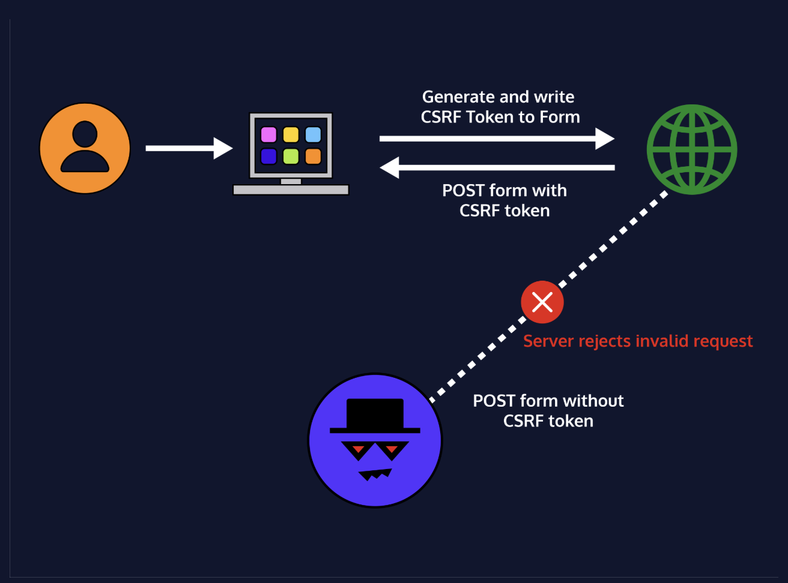

# 8. Cross-Site Request Forgery (CSRF) Attacks


<u>[Cross-Site Request Forgery](https://owasp.org/www-community/attacks/csrf)</u> (CSRF) is a common class of vulnerability that tricks a user into submitting a web request on behalf of an attacker.
In many cases of CSRF, a malicious actor crafts a URL embedded with a request like so:

```
http://bank.com/send?recipient=Stranger&amount=2000

```

and uses clever tricks like link shortening or embedding it into a phishing email to get an authenticated user to click on it! In this example, a user who has an active session with the bank could click on it. The bank will carry out the transaction because the request is being made from that user’s browser! The attacker has hijacked the session and carried out a CSRF attack.

CSRF attacks tend to target the web requests that are state-changing rather than requests that expect meaningful response data. State-changing requests could be: payment for a product, changing account information, transferring funds, changing security settings, and so on. These attacks could be highly detrimental to the victim user, which in turn could also worsen the reputation of the company behind a web application.
# 
## Preventing CSRF
One of the simplest ways to prevent these attacks is to add a CSRF token. This token is a unique value that is added to each request. This value is dynamically generated by the server and used to verify all requests. This token is kept strictly with the form the user is currently on if they were making the legitimate request, so the attacker does not have access to it, and cannot get the user to complete the same request without the token.
Since this value is unique for every request and constantly changing, it is nearly impossible for an attacker to pre-create the URLs/requests for an attack AND bypass the token check.

As an extra layer of security, we can ask users to re-authenticate by manually enter additional information prior to a critical request. For example, prior to changing a username, email, or password, we may want the user to enter their current password. By ensuring the request has the correct password, we can ensure that an attacker isn’t able to easily compromise a user, even with XSS.

## csurf
In order to use the csurf library to implement CSRF tokens, require csurf at the top of **app.js**, then create all required middleware.
For the maximum security, the token should be one usage only.

```
const express = require('express');
const partials = require('express-partials');
const path = require('path');
const app = express();
const cookieParser = require('cookie-parser');
// Require csurf package here
const csurf = require('csurf');

const PORT = 4001;

app.set("views", path.join(__dirname, "/views"));
app.set("view engine", "ejs");
app.use(partials());

app.use(cookieParser());

app.set('trust proxy', 1);

app.use(express.json());
app.use(express.urlencoded({ extended: true }));

app.use(express.static(path.join(__dirname, "/public")));

// Configure csurf middleware here
const csrfMiddleware = csurf({
  cookie: {
    maxAge: 3000,
    secure: true,
    sameSite: 'none'
  }
});

// Use csrf middleware at application level here
app.use(csrfMiddleware);

// Configure error message middleware here
const errorMessage = (err, req, res, next) => {
  if (err.code === "EBADCSRFTOKEN") {
    res.render("csrfError");
  } else {
    next();
  }
};

// Use error message middleware at application level here
app.use(errorMessage);

app.get('/', (req, res) => {
  // Send CSRF token to form
  res.render('order', { csrfToken: req.csrfToken() });
});

app.get('/contact', (req, res) => {
  // Send CSRF token to form
  res.render('contact', { csrfToken: req.csrfToken() });
});

app.post('/submit', (req, res) => {
  res.render('success');
});

app.listen(PORT, () => console.log(`Listening on http://localhost:${PORT}`));

```

And add the csurf token to the html form

```
<form action="/submit" method="POST">
    <!-- Add CSRF token here -->
  <input type="hidden" name="_csrf" value="<%= csrfToken %>" />

    <label for="fname">First Name</label>
    <input style="width:100%" type="text" id="fname" name="firstname" placeholder="Your name..">

    <label for="lname">Last Name</label>
    <input style="width:100%"  type="text" id="lname" name="lastname" placeholder="Your last name..">


    <label for="subject">Subject</label>
    <textarea style="width:100%"  id="subject" name="subject" placeholder="Write something.."></textarea>

    <div>
      <input style="width:100%" type="submit" value="Submit">
    </div>
  </form>

```


