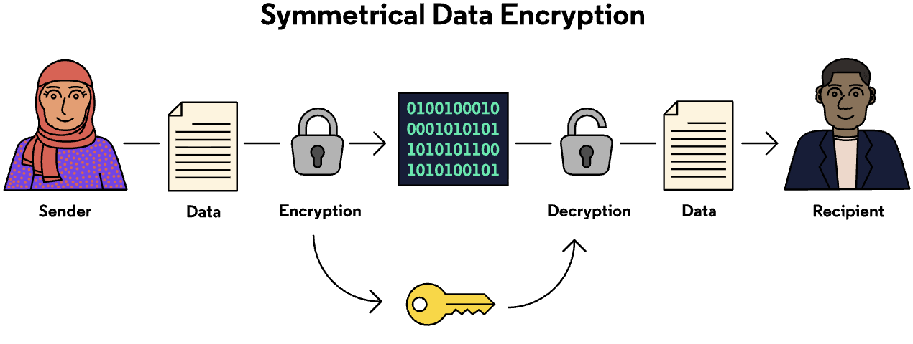
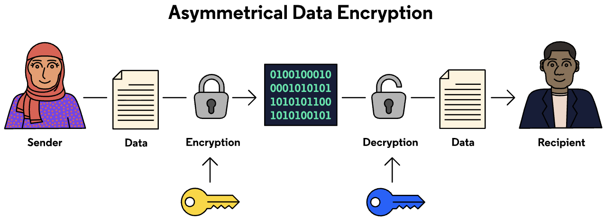
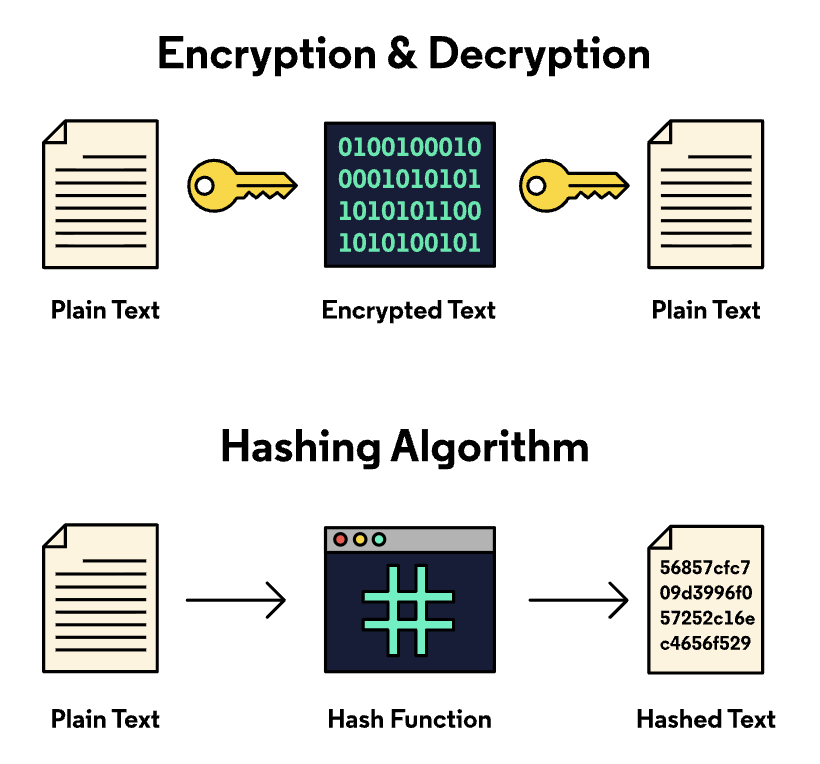

# 6. Hashing vs. Encryption vs. Encoding vs. Obfuscation

## **Encryption**
Cryptography is the science of hiding data and making it available again. In cryptography, hiding data is called *encryption* and unhiding it is called *decryption*. When data is securely exchanged, it is first encrypted by the sender, and then decrypted by the receiver using a special *key*.
There are two main types of encryption: *symmetric* and *asymmetric*.
* Symmetric encryption uses the same key to both encrypt and decrypt data.
* Asymmetric encryption uses two different keys to encrypt and decrypt data.

**Symmetric Encryption**
Symmetric encryption is the fastest way to encrypt data, and the most common for sending large chunks of data, however, it has one major vulnerability: if you send someone your key, then it’s in a form that any other person can read. That means your data is vulnerable to being stolen.

**Asymmetric Encryption**
Asymmetric encryption differs from symmetric encryption in one way: Instead of one key, you have a *key pair*. A key pair is made up of a public key and a private key.
* The *public key* can be given to anyone and is only used to encrypt data.
* The *private key* is kept secret and is only used to decrypt data.
Asymmetric encryption is the most secure way to transmit data; however, it is slower and more complex than symmetric encryption. Therefore, it is primarily used to exchange smaller pieces of data.

## **Hashing**
Hashing does not encrypt data. Instead, *hashing* is a one-way process that takes a piece of data of any size and uses a mathematical function to represent that data with a unique hash value of a fixed size. You cannot compute the original data from its hash.

Because each hash should be unique, hashing allows us to see if changes have been made to documents.
Ideally, hash functions always generate unique values for different inputs. When they don’t it’s called a *hash collision*. While it’s hypothetically possible to encounter a hash collision with nearly any hashing algorithm, with modern algorithms like SHA-256, it would take so long to result in a collision that it’s functionally impossible.

### **Using Hashes to Protect Data**
Hashes are widely used in order to store passwords in online databases. If passwords are stored in plaintext and a database is breached, so are all of the passwords! However, if they are stored as hash values, even if someone hacks into a website’s database, only the password hashes are exposed.
Remember, an attacker has no way of decrypting a hash value to get the original value. Hashing is a one-way process.

## **Encoding**
Encoding, while it may sound similar to encryption, is not actually used to hide data. *Encoding* transforms data into a form that can be used by a different type of system. Some different types of encoding are:
* ASCII (American Standard Code for Information Interchange)
* Unicode
* Base64
When would we ever use one of these? Let’s look at ASCII as an example. ASCII is a character encoding standard that is used to translate human text into something a computer can understand and vice versa. It’s a shared language all computers use to translate human text.
Let’s look at the encoding process with the capital letter “A”.
| Letter           | Decimal Encoding | Binary Encoding  |
|------------------|------------------|------------------|
| A                | 65               | 100 0001         |
| B                | 66               | 100 0010         |
| C                | 67               | 100 0011         |

Looking at an ASCII table, we can encode the capital letter “A” as the number 65. Then, we have to translate 65 into binary which gives us the value 100 0001. Using ASCII encoding, we are able to change “A” into something another system, our computer, can understand.
Encoded information is easily reversed and only requires knowledge of the algorithm used to decode information.

## **Obfuscation**
*Obfuscation* is less about data security and more about securing code. Developers might obfuscate their code in order to hide what their code is actually doing. Obfuscate means to hide the meaning of something by making it difficult to understand. Why would developers do this?
Developers might want to hide trade secrets or intellectual property from others who can access their code. Obfuscating their code makes it difficult for others to steal code and use it for their own purposes. Obfuscation can also make it harder for users to hack software or get around licensing requirements needed to use programs.
Malicious actors might also use obfuscation to make it hard for users or antivirus software to detect a virus they are planting on a system. If you don’t know what an application is for, be very careful before downloading or opening it.

