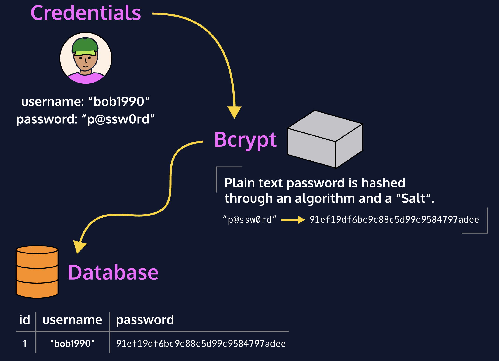

# 8. BCRYPT


You should hash passwords before storing them in a database in order to protect your users from being hacked.
There are plenty of cryptographic hashing functions to choose from, such as the SHA-3 or MD-5 algorithms. SHA-3 and MD-5 algorithms are known to be quite fast. Unfortunately, the faster the function, the faster a hacker can retrieve a hashed password through brute-force attacks. So, using a function that is slower at hashing passwords can actually protect your users.
We can accomplish this by using the bcrypt algorithm and library. Using bcrypt, we can protect our users by hashing *and* salting passwords. Using multiple rounds of hashing ensures that an attacker must deploy massive funds and hardware to be able to crack your passwords.

## 
## **Hash Functions**
bcrypt is hashing algorithm. This means you cannot easily retrieve the plaintext password without already knowing the salt, rounds, and key (password).
On a typical website, when a user first signs up, we retrieve their password and run it through a hashing algorithm. The hashed password is then stored in the database. Whenever the same user logs in, we hash the password they tried to log in with and compare it to the already stored hash value. If the values match, the user is authenticated.

## **Salts and Rainbow Table Attacks**
As with many security measures, hashing isn’t foolproof.
One common way to attempt cracking hashed passwords is through the use of rainbow tables. *Rainbow tables* are large lookup databases that consist of pre-computed password-hash combinations which correlate plaintext passwords with their hashes.
Rainbow tables are complex and consist of two different types of functions:
* A Hashing function: Used by the table must match the hashed password you want to recover.
* A Reduction Function: Transform a hash into something usable as a password. However, it’s important to understand that the reduction function doesn’t reverse the hash value, so it doesn’t output the original plaintext (i.e. the password), because this isn’t possible, but instead outputs a completely new one.
In essence, rainbow tables are massive lookup tables that can crack complex passwords significantly faster than using traditional password cracking methods.
So what are some measures we can take to protect ourselves from rainbow table attacks? One common technique is the use of *salts*. A salt is a random value that is added to the input of a hashing function in order to make each password hash unique even in the instance of two users choosing the same passwords. Salts help us mitigate hash table attacks by forcing attackers to re-compute them using the salts for each user.

## **Using bcrypt to Hash Passwords**
Bcrypt uses a salt and salt rounds to secure a password.
* A *salt* is a value that is concatenated to a password before hashing in order to make it less vulnerable to rainbow table and brute-force attacks.
* A *salt round* can be described as the amount of time needed to calculate a single bcrypt hash. The higher the salt rounds, the more time is necessary to crack a password.
In this asychronous implementation, we’ll generate a salt and hash in the same function call. This involves 3 steps:
1. Generate a salt
2. Hash the password
3. Return null if there’s an error

```
const passwordHash = async (password, saltRounds) => {
  try {
    const salt = await bcrypt.genSalt(saltRounds);
    return await bcrypt.hash(password, salt);
  } catch (err) {
    console.log(err);
  }
  return null;
};

```

- The built-in genSalt() function automatically generates a salt.Once we have a salt generated, we make a call to bcrypt.hash(). bcrypt.hash() takes in a password string and a salt.We also want to handle potential errors. In the catch block, we can print out the error with console.log(). Lastly, we return null if there’s an error with bcrypt and we’re unable to hash a password.
## **Verifying Passwords**
The process of comparing passwords should look as follows:
1. Retrieve plain text password.
2. Hash the password.
3. Compare the hashed password with the one stored in our DB. (Since we’re using the same hash, it should return the same value if the password is correct.)

```
const comparePasswords = async (password, hash) => {
  try {
    const matchFound = await bcrypt.compare(password, hash);
    return matchFound;
  } catch (err) {
    console.log(err);
  }
  return false;
};

```

- bcrypt provides us with a handy function called compare() which takes in a plaintext password, password and a hashed password, hash:bcrypt.compare() deduces the salt from the provided hash and is able to then hash the provided password correctly for comparison.
We can include a function that verifies if the password entered is valid. We’ll use an asynchronous function and pass in password and hash as its parameters.
- The return value will be true if the password provided, when hashed, matches the stored hash. Outside the try/catch block we can return false in order to end the execution of the code if there were any other errors or if bcrypt did not execute correctly.
## **Bcrypt in a CRUD App**
When creating an authentication flow, we should never store passwords as plaintext. Instead, we can take the password retrieved from a user’s input and hash it using bcrypt. Once it’s hashed, *then* we can store it in our database.
Before creating a new user object, we must first hash the password and store that value:

```
const salt = await bcrypt.genSalt(10);

const hash = await bcrypt.hash(password, salt);

const newUser = {
  email,
  password: hash
};

await user.save();

```

Once hashed, that value will be stored in our database and protect the password from brute-force attacks.
Using bcrypt.compare() pulls the salt out of stored hash in the database and uses it to hash the retrieved password and perform the comparison. The function will then return true if the passwords match and false if they don’t.

```
const { email, password } = req.body;
let user = await User.findOne({ email: email });
// ...

// Use bcrypt to hash the retrieved password and compare it to hash stored in database:
const matchedPassword = await bcrypt.compare(password, user.password);

```


